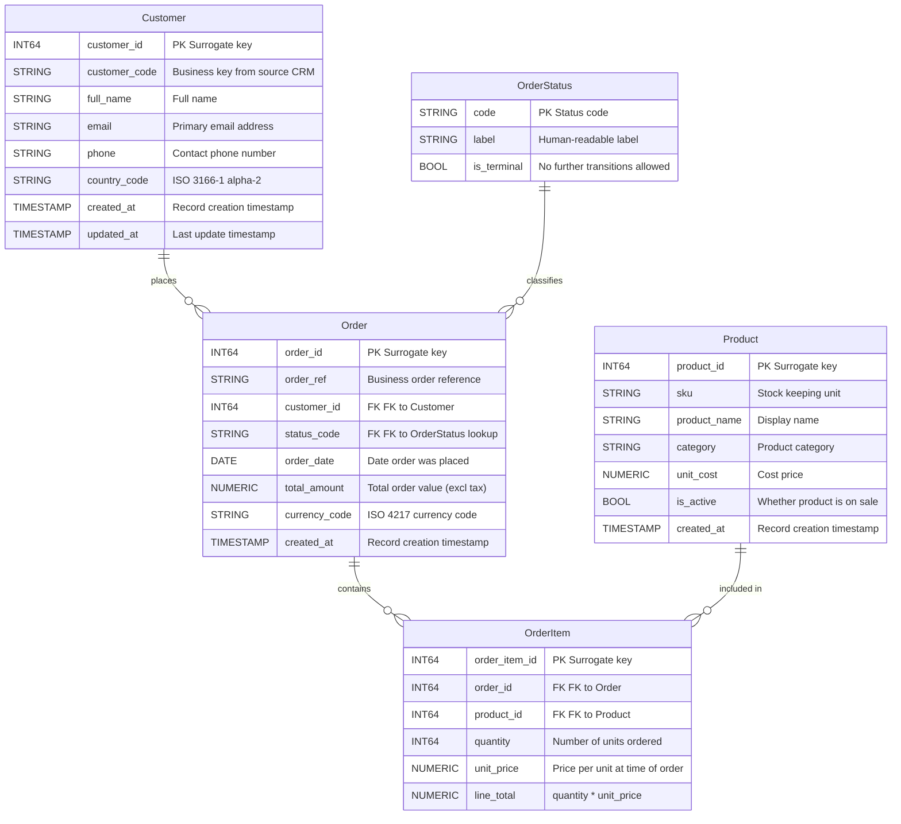

# Logical Entity-Relationship Diagram

> Auto-generated from `sample_data_model.xlsx` on 2026-03-18.
> Review and adjust cardinality where marked `-- inferred --`.

```mermaid
erDiagram
    Customer {
        INT64 customer_id "PK Surrogate key"
        STRING customer_code "Business key from source CRM"
        STRING full_name "Full name"
        STRING email "Primary email address"
        STRING phone "Contact phone number"
        STRING country_code "ISO 3166-1 alpha-2"
        TIMESTAMP created_at "Record creation timestamp"
        TIMESTAMP updated_at "Last update timestamp"
    }
    Order {
        INT64 order_id "PK Surrogate key"
        STRING order_ref "Business order reference"
        INT64 customer_id "FK FK to Customer"
        STRING status_code "FK FK to OrderStatus lookup"
        DATE order_date "Date order was placed"
        NUMERIC total_amount "Total order value (excl tax)"
        STRING currency_code "ISO 4217 currency code"
        TIMESTAMP created_at "Record creation timestamp"
    }
    OrderItem {
        INT64 order_item_id "PK Surrogate key"
        INT64 order_id "FK FK to Order"
        INT64 product_id "FK FK to Product"
        INT64 quantity "Number of units ordered"
        NUMERIC unit_price "Price per unit at time of order"
        NUMERIC line_total "quantity * unit_price"
    }
    Product {
        INT64 product_id "PK Surrogate key"
        STRING sku "Stock keeping unit"
        STRING product_name "Display name"
        STRING category "Product category"
        NUMERIC unit_cost "Cost price"
        BOOL is_active "Whether product is on sale"
        TIMESTAMP created_at "Record creation timestamp"
    }
    OrderStatus {
        STRING code "PK Status code"
        STRING label "Human-readable label"
        BOOL is_terminal "No further transitions allowed"
    }

    Customer ||--o{ Order : "places"
    Order ||--o{ OrderItem : "contains"
    Product ||--o{ OrderItem : "included in"
    OrderStatus ||--o{ Order : "classifies"
```
